  

     

# 🛡️ Awesome Credential Verification Platform
**A Curated Directory of SaaS Solutions & Open-Source Projects for Digital Badges, Verifiable Credentials (W3C VC), Decentralized Identity (SSI), and Cryptographic Attestations**

*Last updated: August 2026*

---

## 📖 Overview & Ecosystem Landscape

The **Credential Verification Platform** ecosystem encompasses hosted SaaS platforms and open-source frameworks designed to issue, manage, hold, present, and verify digital credentials with cryptographic integrity, privacy preservation, and selective disclosure.

Whether you are building enterprise decentralized identity (SSI) networks, educational degree verifications, professional micro-credentials, or Open Badges 3.0 ecosystems, this repository maintains the industry reference list for both cloud providers and open-source stacks.

### 🔑 Key Standards & Core Technologies
- **W3C Verifiable Credentials (VC v1.1 & v2.0)** & **Decentralized Identifiers (DIDs)**
- **Open Badges 2.0 / 3.0** (1EdTech standard aligned with W3C VCs)
- **Zero-Knowledge Proofs (ZKPs)** & **Hyperledger AnonCreds** (Predicate proofs & selective attribute disclosure)
- **OpenID for Verifiable Credential Issuance (OID4VCI)** & **OpenID for Verifiable Presentations (OID4VP)**
- **eIDAS 2.0 & European Digital Identity (EUDI) Wallet Architecture**
- **Blockcerts** (Blockchain-anchored verifiable records)

---

## 📑 Table of Contents
- [🏢 SaaS & Hosted Platforms](#-saashosted-platforms)
- [💻 Open-Source GitHub Projects](#-open-source-github-projects)
- [🧩 Additional Ecosystem Components & Standards](#-additional-ecosystem-components--standards)
- [🤝 How to Contribute](#-how-to-contribute)
- [⭐ Star History](#-star-history)
- [📜 Disclaimer](#-disclaimer)

---

## 🏢 SaaS/Hosted Platforms

The table below provides a comparative analysis of category-leading SaaS credential platforms, sorted in descending order of **company scale (revenue / valuation)**.

| Platform | Overview & Focus | Est. Company Size (Rev / Valuation) | Starting Pricing | Free Tier / Trial Limits |
| :--- | :--- | :--- | :--- | :--- |
| **[Credly](https://www.credly.com/)** (Pearson) | Enterprise digital badging platform with a global earner network, Open Badges standard support, and employer talent recognition. | **~$5.0B Rev (Parent)** / $200M Acquisition | **$2,500 / year** (~$208/month for entry organizational issuer plans with base badge volume) | **Free Forever for Earners** (unlimited badge receiving, storage, and sharing); organizations receive custom sandbox demos on request (no self-serve free trial). |
| **[Hyland Credentials](https://www.hyland.com/)** (Hyland Software) | Enterprise blockchain-anchored credentialing platform (Blockcerts standard) for universities issuing tamper-proof diplomas and transcripts. | **~$1.2B Rev** / ~$4.0B Valuation | **$5,000 / year** (Institutional entry deployment packages with baseline student record issuance volume) | **Free Forever Verification Portal** for public verifiers and recipients; institutional pilot sandbox trial provided during evaluation. |
| **[Digitary](https://www.digitary.net/)** (Parchment / Instructure) | Higher-education academic credential and transcript verification platform used globally for tamper-evident digital records. | **~$530M Rev** / $835M Acquisition | **$3,500 / year** (Institutional registry licenses, or student-pay platform pricing at ~$5–$15 per official transcript order) | **Free Forever for Students** (access, storage, and sharing via Digitary Core wallet); institutional guided sandbox demo on request. |
| **[Accredible](https://www.accredible.com/)** | Digital certificates and badges platform with custom design tooling, verification pages, LMS integrations, and Open Badges / W3C VC support. | **~$15M - $20M ARR** / ~$100M+ Valuation | **$45 / month** (Launch Plan, billed annually at $540/year for up to 100–250 unique recipients/year with unlimited issuances) | **Free Trial**: Full platform and design tooling access to issue digital credentials to up to 20 unique recipients. |
| **[Affinidi](https://www.affinidi.com/)** | Decentralized identity and data-sharing platform supporting W3C VCs, consent-based exchange, and privacy-preserving verification. | **Temasek-backed** (~$100M+ Funding Backing) | **$49 / month** (Builder Plan; additional API credits at ~$0.005/credit) | **Essential Plan (Free Forever)**: 10,000 monthly Affinidi Credits and up to 100 Monthly Active Users (MAUs) for login and credential exchange. |
| **[Validated ID](https://www.validatedid.com/)** | European digital identity, electronic signature, and SSI platform (VIDsigner/VIDidentity) compliant with eIDAS qualified credentials. | **~$12M - $18M ARR** / ~€40M Valuation | **€24.90 / month** (~$27/mo, or $10/mo billed annually for entry-level plans based on volume) | **30-Day Free Trial**: Complete feature access with up to 50 test signature and identity validation envelopes. |
| **[Trinsic](https://trinsic.id/)** | API-first verifiable credentials and decentralized identity acceptance platform for issuance, verification, and digital wallet integrations. | **~$8.5M+ Funding** / ~$40M Valuation | **$0.10 / verification** (Starter live credit blocks from $99/mo; volume tiers scale lower with higher commitments) | **Free Forever Test Sandbox**: Unlimited mock credential verifications, testnet DID creation, and API access with $0 transaction fees. |
| **[Velocity Network Foundation](https://www.velocitynetwork.foundation/)** | Consortium-governed decentralized network ("Internet of Careers") for verifiable education and workforce credential exchange. | **Non-profit consortium** (50+ enterprise members / $25M+ Ecosystem) | **$2,500 / year** (Associate / General member tier dues; token-native network usage at ~$0.02–$0.05 in $VLCT per credential transaction) | **Free Forever for Individuals/Earners** (claiming, storing, and sharing career credentials); free permanent developer Testnet access with test vouchers. |
| **[Dock Labs](https://www.dock.io/)** (Truvera) | Verifiable credential infrastructure with blockchain anchoring on the Dock network, schema monetization, and DID management. | **~$20M+ Raised** / ~$18M Valuation | **$250 / month** (Production platform; Mainnet issuance at ~0.05 DOCK / ~$0.02 per credential) | **Free Forever Testnet**: Unlimited testnet DID creation, schema registration, and credential issuance via test faucet; 14-day guided evaluation trial on request. |
| **[Sertifier](https://sertifier.com/)** | Digital badge and certificate automation platform with skill mapping, LMS/CRM integrations, and verifiable credential tracking. | **~$3M - $5M ARR** / ~$15M Valuation | **$250 / year** (~$21/month for Pro Plan with custom branded credential portals; Enterprise from $1,200+/yr) | **Free Forever Plan**: Up to 250 unique recipients/year with unlimited credential issuance; plus a **14-day free trial** of all Pro features (no credit card required). |
| **[Sphereon](https://sphereon.com/)** | Enterprise-grade SSI, W3C Verifiable Credentials, OpenID4VC/VP, and eIDAS 2.0 compliant wallet and verification infrastructure. | **~$3M - $6M Revenue** (EU Enterprise SSI Vendor) | **€500 / month** (~$545/mo billed annually for Enterprise VDX API Gateway & developer agent licenses) | **30-Day Free Sandbox Trial**: Full access to REST APIs, test digital wallets, and eIDAS sandbox environment upon developer registration. |
| **[BadgeCert](https://www.badgecert.com/)** | Cloud-based digital credentialing and verification platform designed for professional associations, certification boards, and training bodies. | **~$2M - $4M ARR** (Self-sustaining) | **$1,000 / year** (Bronze Plan for up to 500 badges/year; Silver Plan at $1,500/year for up to 1,000 badges/year) | **Free 1-Badge Trial Demo** via Discover portal + enterprise sandbox test environment available on request. |
| **[Open Badge Factory](https://openbadgefactory.com/)** | Modular Open Badges (1.2/2.0/3.0) and verifiable credential platform supporting badge creation, passport integration, and federation. | **~$1.5M - $3M ARR** (EU Micro-SME) | **€220 / year** (~$240/year for Basic Plan with up to 10 badge classes and 5,000 badges/year; Premium at €700/year) | **60-Day Free Trial**: Full Pro Plan access (up to 50,000 badges/yr, PDF certificates, API access, and reporting; no credit card required). |

---

## 💻 Open-Source GitHub Projects

The following production-ready open-source agents, frameworks, and tools are sorted in descending order of **GitHub Stars** ⭐.

- **[Veramo](https://github.com/decentralized-identity/veramo)**   
  Modular JavaScript and TypeScript framework for verifiable credentials, decentralized identifiers (DIDs), cryptographic key management, and linked data presentations.
- **[ACA-Py (Aries Cloud Agent – Python)](https://github.com/openwallet-foundation/acapy)**   
  Foundational open-source (Apache 2.0) self-sovereign identity agent maintained by the OpenWallet Foundation. Enables issuance, holding, and verification of verifiable credentials (AnonCreds and W3C VC/JSON-LD) using Aries protocols.
- **[Blockcerts Cert-Issuer](https://github.com/blockchain-certificates/cert-issuer)**   
  Open-source reference implementation from MIT Media Lab / Learning Machine for issuing blockchain-anchored digital certificates (Blockcerts standard) on Bitcoin and Ethereum blockchains.
- **[Credo-TS](https://github.com/openwallet-foundation/credo-ts)**   
  Pure TypeScript framework (formerly Aries Framework JavaScript) for building SSI agents, wallets, and verifiable credential exchange applications across Node.js, React Native, and web browsers.
- **[DIDKit](https://github.com/spruceid/didkit)**   
  Cross-platform library written in Rust with bindings for C, Java, WASM, and Flutter, providing core tools for signing, issuing, and verifying W3C Verifiable Credentials and DIDs.
- **[Walt.id Identity Suite](https://github.com/walt-id/waltid-identity)**   
  Developer-friendly open-source identity and verifiable credentials engine supporting W3C VC, OpenID4VC, SD-JWT, and multiple blockchain/ledger ecosystems.
- **[SpruceID SSI](https://github.com/spruceid/ssi)**   
  Comprehensive Rust library implementing W3C Decentralized Identifiers (DIDs), JSON-LD Verifiable Credentials, Linked Data Signatures, and cryptographic proof suites.
- **[Bifold Wallet](https://github.com/openwallet-foundation/bifold-wallet)**   
  Extensible open-source React Native digital identity wallet maintained under OpenWallet Foundation for holding, managing, and presenting verifiable credentials.
- **[Sunbird RC](https://github.com/Sunbird-RC/sunbird-rc-core)**   
  Scalable open-source framework for building electronic registries, attestation engines, and verifiable credentialing pipelines — widely adopted in national digital public infrastructure.
- **[DID-JWT-VC](https://github.com/decentralized-identity/did-jwt-vc)**   
  Lightweight Decentralized Identity Foundation (DIF) JavaScript library for creating, signing, and verifying W3C Verifiable Credentials and Presentations encoded as JSON Web Tokens (JWT).
- **[Blockcerts Cert-Verifier-JS](https://github.com/blockchain-certificates/cert-verifier-js)**   
  Universal client-side JavaScript verification library that validates Blockcerts cryptographic proofs, blockchain merkle receipts, and revocation status without third-party dependencies.
- **[Web5-JS](https://github.com/TBD54566975/web5-js)**   
  Decentralized web platform library from TBD / Block implementing Decentralized Identifiers (DIDs), Verifiable Credentials (VCs), and Decentralized Web Nodes (DWNs).
- **[Business Partner Agent](https://github.com/hyperledger-labs/business-partner-agent)**   
  Self-sovereign identity wallet and controller built on ACA-Py, optimized for B2B organizational workflows to issue, hold, and verify enterprise credentials.
- **[CREDEBL Platform](https://github.com/credebl/platform)**   
  Enterprise-grade open-source decentralized identity platform providing modular microservices for multi-tenant credential issuance, verification, and schema governance.
- **[AnonCreds Rust](https://github.com/openwallet-foundation/anoncreds-rs)**   
  High-performance Rust implementation of the AnonCreds zero-knowledge verifiable credential format, supporting selective attribute disclosure and cryptographic predicate proofs.
- **[Certo](https://github.com/schroedinger-hat/certo)**   
  Open-source platform for issuing, managing, and verifying Open Badges 3.0 (aligned with W3C Verifiable Credentials) for communities, events, and workshops.

---

## 🧩 Additional Ecosystem Components & Standards

- **OpenWallet Foundation (OWF)**: Core working groups standardizing open-source digital wallet engines and credential interoperability layers.
- **Decentralized Identity Foundation (DIF)**: Specifications for Credential Manifest, Presentation Exchange, and DIDComm messaging protocols.
- **Universal Resolver & Universal Registrar**: Drivers for resolving and registering `did:web`, `did:key`, `did:ion`, `did:cheqd`, and `did:indy` methods.
- **C2PA (Coalition for Content Provenance and Authenticity)**: Cryptographic manifest standard for media provenance and digital content assertions.

---

## 🤝 How to Contribute

We welcome community contributions to keep this directory current, accurate, and comprehensive!

1. Fork this repository: `https://github.com/ishandutta2007/Awesome-Credential-Verification-Platform`.
2. Edit [`README.md`](file:///C:/Users/ishan/Documents/Projects/Awesome-Credential-Verification-Platform/README.md) following the existing tabular or badge format.
3. For SaaS platforms, include specific starting pricing, free tier/trial limits, and revenue/valuation metrics.
4. For open-source projects, include the proper `style=social&color=white` GitHub star badge and place it in descending order of stars.
5. Submit a Pull Request with a clear description of the addition or update.

Check out [Awesome Awesome Awesome](https://github.com/ishandutta2007/Awesome-Awesome-Awesome) for more curated developer lists!

---

## ⭐ Star History

---

## 📜 Disclaimer

- This is an independent, **community-curated** list for research and evaluation purposes; inclusion does not constitute an endorsement.
- Credential verification platforms should be evaluated according to relevant regional compliance frameworks (e.g., eIDAS 2.0, FERPA, GDPR) and open standards compliance (W3C VC, Open Badges 3.0, ISO/IEC 18013-5 mDL).
- Pricing and company valuation figures are based on publicly disclosed metrics, investor filings, and market research and may vary over time.
